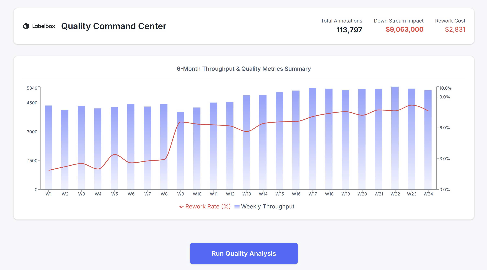

# Labelbox Quality Monitor

A comprehensive dashboard for monitoring, diagnosing, and improving data annotation quality to prevent catastrophic downstream business costs.

### [View the Live Demo](https://labelbox-quality-monitor.vercel.app/)

---

## The Problem: The Hidden Financial Drain of Annotator Drift

In large-scale data annotation projects, "annotator drift"—the slow, unmonitored decay of labeling quality—is not a minor issue. It's a silent killer of ROI. Degraded data quality introduces a cascade of severe financial consequences, from direct rework costs to catastrophic model failures that can damage brand reputation and nullify enterprise contracts.

This QA Command Center was built to expose these hidden costs and provide the tools to mitigate them before they impact your bottom line.

## The Financial Impact: A Case Study

Based on a 6-month simulation of a 5-person annotation team, the financial fallout from unmonitored quality drift is staggering.

| Metric | Value | Description |
| :--- | :--- | :--- |
| **Total Annotations** | **113,797** | The total volume of work produced. |
| **Direct Rework Cost** | **$2,831** | The immediate, tangible cost of paying annotators to fix their own mistakes. |
| **Downstream Impact** | **$9,063,000** | The estimated annual revenue loss from deploying a model trained on degraded data. |

This dashboard demonstrates that the direct cost of rework is trivial compared to the multi-million dollar downstream impact. **Investing in quality assurance is not an expense; it's insurance against catastrophic failure.**



## Features as Business Solutions

The Quality Monitor is designed to provide actionable, business-critical insights.

* **Instantly Visualize Project ROI & Risk:** The main dashboard provides a high-level view of project health, tracking throughput against quality metrics. Immediately identify when quality decay begins to threaten your project's financial viability.
* **Diagnose and Mitigate Costly Errors at the Source:** Drill down into the performance of individual annotators to pinpoint the root causes of rework and quality degradation. Use data-driven insights to conduct targeted retraining and improve team efficiency.
* **Prevent Catastrophic Model Failure with Visual Evidence:** Use the "Evidence Locker" to inspect the specific data rows causing team-wide disagreement and concept drift. Resolve guideline ambiguity before it poisons your dataset and leads to production model failure.

## Local Setup & Installation

To run the dashboard locally and explore its full capabilities:

**1. Clone the Repository**

```bash
git clone https://github.com/minhkhoango/labelbox-quality-monitor.git
cd labelbox-quality-monitor
```

**2. Install Dependencies**

```bash
npm install
```

**3. Run the Development Server**

```bash
npm run dev
```

Navigate to `http://localhost:3000` in your browser.

## Contribution

This project is currently in a demo stage. For bug reports or feature suggestions, please open an issue. Ensure titles are technical and precise (e.g., "Bug: IoU chart fails to render with null values").
